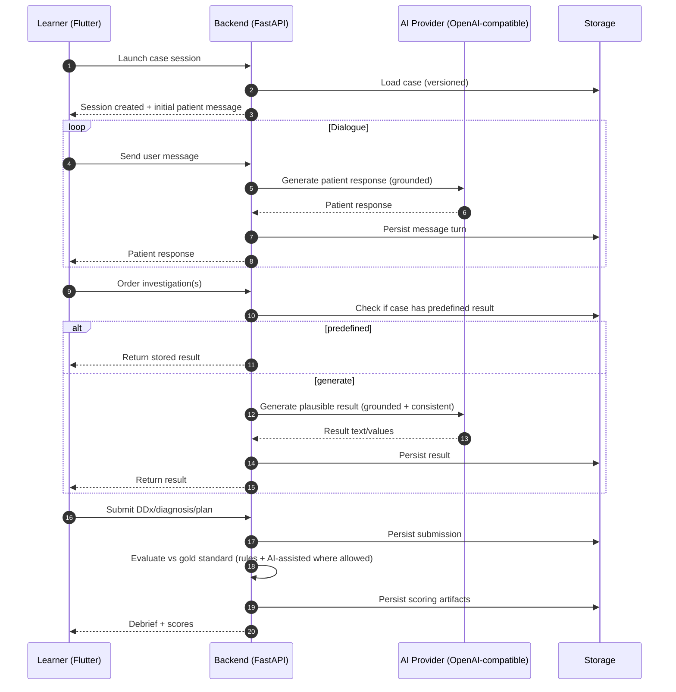

# System Architecture — Virtual AI Patient (Overview)

## 1. Components
- **Flutter Client**
  - Chat UI
  - Investigations ordering UI
  - Submission forms (DDx/diagnosis/plan)
  - Debriefing view

- **FastAPI Backend**
  - Auth / SSO integration
  - Case catalog and access control
  - Session state machine
  - AI orchestration (patient dialogue + investigation generation)
  - Evaluation and scoring
  - Analytics export

- **AI Provider (OpenAI-compatible)**
  - OpenAI-style REST API
  - Token-based authentication
  - Model routing configurable per environment

- **Storage**
  - Case content store (versioned cases)
  - Session store (messages, orders, submissions)
  - Evaluation artifacts (scores, evidence)

## 2. Data flow (typical session)

## 3. Architectural principles
- **Case-grounded generation**: the AI layer must not invent facts that contradict the case truth.
- **Reproducible scoring**: cases are versioned; scoring references a specific case version.
- **Provider-agnostic AI adapter**: only one integration layer speaks OpenAI-compatible API.
- **Auditable evaluation**: every score deduction has evidence and rationale for debriefing.
- **Security by design**: no real patient data; strict separation of case content vs user data.

